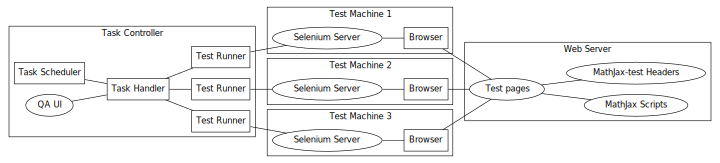

.. _components:

############################
Testing Framework Components
############################

This section gives an overview of the different testing framework components.

.. _overview:

Overview
========

The diagram above summarizes the components of the testing framework. There are
several :ref:`test machines <test-machine>` on which a browser is executing test
pages. These test pages are loaded from a :ref:`web servers <web-servers>`,
together with the relevant Javascript files.

In order to execute testing instances on the test machines, a
:ref:`test runner <test-runner>` python script is used. Although this program
can directly be called :ref:`using the command line <command-test-runner>`,
there is a more general :ref:`task controller <task-controller>` to handle
several testing instances and which is preferable to use.

.. _web-servers:

Web Servers
===========

As previously seen, each :ref:`unit test <unit-test>` is made of one or two HTML
pages. All these pages can be stored on any Web server, indicated by the
**mathJaxTestPath** :ref:`configuration option <test-runner-config>`. The pages
use various
:ref:`Javascript headers <mathjax-test-headers>` located on the same Web server.

The test pages also need to use MathJax javascript files. It is also possible to
test a MathJax installation on any Web server, indicated by the **mathJaxPath**
:ref:`configuration option <test-runner-config>`.

.. _test-machine:

Test Machine
============

A **test machine** is a given operating system with a basic set up. Typically,
we want a graphical interface, browsers, fonts, plugins etc. It can be the local
machine on which the testing framework is installed, virtual machines on the
same host or even other remote hosts.

`Typical configurations <https://sites.google.com/site/mathjaxproject/design-documents/testing/platforms-supported>`_ for test machine include:

  - Operating System: Linux, MacOS, Windows.
  - Browser: `Chrome <https://www.google.com/chrome/index.html>`_, `Firefox <http://www.mozilla.org/firefox/>`_, `Internet Explorer <http://windows.microsoft.com/en-us/internet-explorer/products/ie/home>`_, `Opera <http://www.opera.com/>`_, `Safari <http://www.apple.com/safari/>`_.
  - `Fonts <https://developer.mozilla.org/@api/deki/files/6182/=MathML-fonts.zip>`_: STIX and MathJax fonts .
  - Plugin: `MathPlayer <http://www.dessci.com/en/products/mathplayer/>`_

A **Selenium server** must be running on this machine, to ensure communication
between the test runner and the browser. It is the
``selenium-server-standalone-*.jar`` java executable that you can find on
`code.google.com <http://code.google.com/p/selenium/downloads/list>`_ or is
``testRunner/seleniumServer.jar`` if you have already done the
:ref:`basic installation <basic-install>`. It can be executed with the command

.. code-block:: sh

   java -jar name-of-the-selenium-server.jar

or by :ref:`other alternative ways <executing-selenium-servers>` .

Note for Selenium 1: 
because some unit tests need to take screenshots of test pages, one
should not do any actions on the test machines that could disturb the rendering
of the pages. In particular, it is neither possible to run several testing
instances on the same test machine simultaneously nor to use the operating
system graphical interface to do other work while the tests are running. If you
want to run tests on your local machine, a tip is to use virtual test machines.

Note for Selenium 2 (Webdriver):
The test machine may require installation of other programs than simply the
Selenium server. See the page
`platforms supported <https://sites.google.com/site/mathjaxproject/design-documents/testing/platforms-supported>`_
for a more precise description of the requirements specific to each browser.

.. _test-runner:

Test Runner
===========

The test runner is the program which allows to launch test instances on
test machines. It may me configured with many options. Here is the exhaustive
list:

.. _test-runner-config:

- Framework configuration options

  - ``host``, ``port``: the host and port of a Selenium Server running on a test
    machine.
  
  - ``mathJaxPath``: the absolute uri to a ``MathJax/`` installation. This
    allows to test different versions of MathJax. When trying to debug
    javascript errors, you may want to point to the ``unpacked/`` version of
    MathJax, which may be less efficient but provide more accurate error
    messages.
  
  - ``mathJaxTestPath``: the absolute uri to a ``MathJax-test/testsuite/``
    directory containing the test pages.
  
  - ``timeOut``: time in seconds before aborting the loading of a page.
  
  - ``useWebDriver``: whether the testing instance should use Selenium
    (Webdriver) or Selenium 1.

  - ``fullScreenMode``: indicates whether the browsers should be opened in full
    screen mode when possible. Only relevant with Selenium 1.
  
  - ``formatOutput`` : indicates whether the output should be formatted in HTML,
    using the Perl script
    `clean-reftest-output.pl <../doxygen/clean-reftest-output_8pl.html>`_.
  
  - ``compressOutput``: indicates whether the output should be gzipped
  
- Platform configuration options

  - ``operatingSystem``: Windows, Linux, Mac
  
  - ``browser``: Firefox, Safari, Chrome, Opera, MSIE, Konqueror, HTMLUnit, iPhone, Android
  
  - ``browserVersion``: browser version.

  - ``browserMode``: Internet Explorer mode among Quirks, IE7, IE8 and IE9.
  
  - ``browserPath``: auto or path to the browser executable on the test machine.
    This option is ignored if several browsers are specified (see below).
  
  - ``font``: STIX, TeX or ImageTeX
  
  - ``outputJax``: HTML-CSS, SVG or NativeMML. For unit tests which do not
    specify the MathML engine, this option forces a specific output jax to
    render mathematics.
  
- Test Suite configuration options

  - ``runSlowTests``: whether to run unit tests marked "slow".
  
  - ``runSkipTests``: whether to run unit tests marked "skip".

  - ``listOfTests``: the subset of the test suite to run. See the reftest
    selector (ADDREF) for a detailed description.

  - ``startID``: the ID of the test to start with. This is mainly used when a
    testing instance was interrupted. In that case, the text ouput contain a
    startID that we can use to recover the testing instance. 
  
``browser``, ``browserVersion``, ``browserMode``, ``font`` and ``outputJax`` may
be a list of elements separated by white spaces. In that case, testing instances are
executed for all the possible combinations of browser, browserVersion,  font,
outputJax and browserMode The rationale for this feature is to provide a
convenient way to run several instances on an operating system in one go. This
is mainly useful when you work in command line but you may ignore them if you
use the :ref:`task controller <task-controller>` instead.

For most non boolean options, one can indicate to use a default value which
depends on your framework configuration. See the file
``testRunner/config/default.cfg`` for an example.

.. _task-controller:

Task Controller
================

This is an additional component to centralize the control of the testing
instances and make it more convenient for QA engineers.

The **task handler** is a server that maintains a list of tasks. It
can receive instructions to add new tasks, run tasks etc It stores information
on each task, such as
:ref:`configuration options <test-runner-config>` to use. When the task handler
runs a task, it creates a new :ref:`test runner <test-runner>` process and
communicates with it to stay informed of the testing instance status and
progress, to know whether the process has been killed etc

A **QA User Interface** is available to verify the status of each task, the
information on the task, to edit, schedule and run tasks etc It directly sends
the instructions to the task handler. Actions can be made throughout the command
line with the help of the ``taskViewer.py``,  ``hostInfo.py`` and
``taskEditor.py`` Python scripts. A web interface is also available. See the
section :ref:`QA tools <qa-web-interface>`. 

A **Task Scheduler** can memorize tasks to run regularly at a specified date and
time. It is based on the `cron <http://en.wikipedia.org/wiki/Cron>`_ tool and
thus accepts the same syntax. It sends run instructions to the task handler
when a task should be started. 
