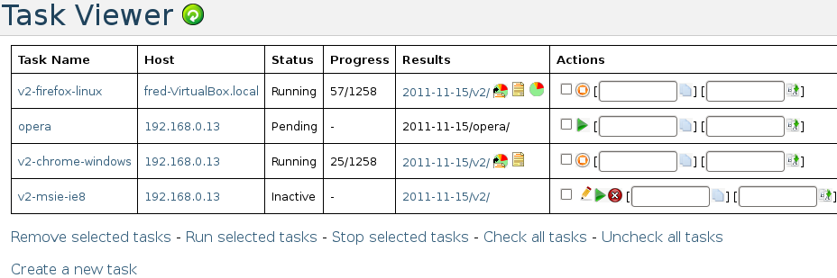
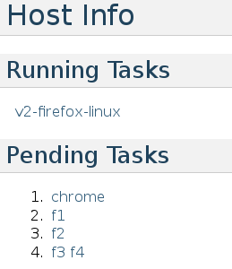
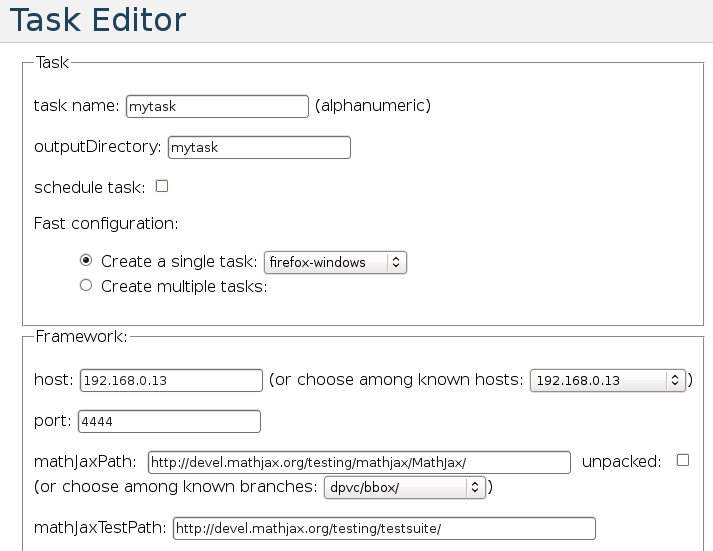
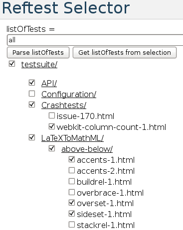
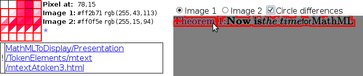

.. _qa-web-interface:

****************
QA Web Interface
****************

This section describes the QA Web interface, which allows to edit and control
the tasks on test machines.

.. _task-viewer:

Task Viewer
===========

The **Task Viewer** is the main control interface of the QA Web interface. It
contains a  table of task, basic information and actions to perform on them.

Note that the task viewer page is not reloaded automatically. To get the last
status one has to refresh the page, for example using the green button at the
top of the page.

At the bottom of the page, you have a link to the 
:ref:`task editor <task-editor>` to create new tasks. You will also find
actions to perform on a group of selected tasks. You can select/unselect
individual tasks by clicking on their checkboxes in the Actions column. You can
also select/unselect all tasks in one go using the links at the bottom of the
page.

The Status can take various values. ``Inactive`` means that the task
has been created but no actions have been performed on it yet. When one asks a
start to start, it may wait for another task to complete on the test machine and
thus is ``Pending``. Otherwise, the task becomes in the state ``Running``. Its
execution can be stopped in various way: ``Killed`` if an error occured,
``Interrupted`` if the someone stopped the task and ``Complete`` if it
all the tests have been executed. While the task is running, the Progress is
updated: it is first set to Init and then to the number of tests executed over
the number of tests to execute for this task.

If you click on the task or host name, you can get more detailed
information :ref:`on the task <task-info>` or :ref:`on the host <host-info>`.
The results column contains link to the result directory as well as to
:ref:`text and formatted outputs <test-results>`
if they have been created. When a task is running, the
results are written in the text output and only formatted when the task is
complete. It may be useful to format the intermediate result, so a button is
available to do so.

Finally, the Actions column contains field to clone or rename tasks. Depending
on the status of the task it also contains buttons to edit, run, restart, stop,
interrupt or remove a task. The difference between run and restart is that the
former tries to recover an interrupted task whereas the latter reinitializes it.

.. _task-info:

Task Info
=========

This page list informations on a given task. It essentially contains the
informations available from the :ref:`task viewer <task-viewer>` as well 
the :ref:`configuration options <test-runner-config>` of the task.

.. image:: images/task-info.png
   :alt: Task Info

.. _host-info:

Host Info
=========

This page list the running and pending tasks on a given host. Links to
:ref:`the task informations <task-info>` are provided. Tasks are expected to
be executed in the order they are listed. When several tasks are listed in the
same line, that means they are expected to be executed simultaneously.

.. _task-editor:

Task Editor
===========

This page enables you to create or edit a task. You will find on this page usual
:ref:`configuration options <test-runner-config>` as well as some additional
parameters such as output directory or schedule date.

The page proposes several predefined values to configure a task quickly and
some fields are updated automatically. For example, if you enter the name of an
existing task, the current configuration is loaded. A fast configuration is
also made available to load a template configuration or to create several tasks
in one go. You also have a way to choose a list of tests using the 
:ref:`reftest selector <reftest-selector>`

.. _reftest-selector:

Reftest Selector
================

The reftest selector enables you to choose a list of test. You can parse a
string describing an existing list of test (the one contain in the
``listOfTests`` :ref:`configuration option <test-runner-config>`) or create one
with respect to the boxes checked on the page.

You can click on a directory to open or close it. You can choose individual
tests by checking its box. If you check (respectively uncheck) a directory box,
all the tests contained in the directory will be check (respectively uncheck).

.. _reftest-analyser:

Reftest Analyser
================

This tool borrowed from Mozilla allows to analyse visual reftests. If a test and
its reference render differently, you can easily compare them and circle the
differences.

